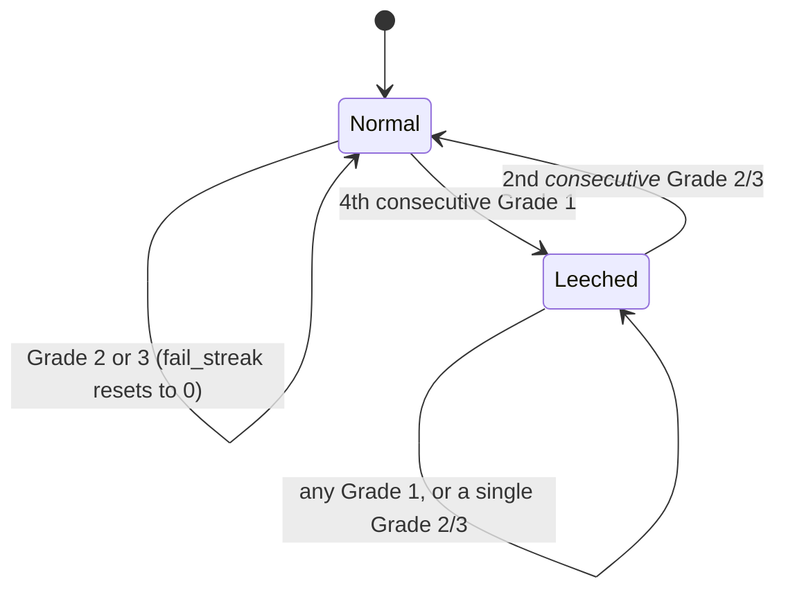

# LeetCode Contest SRS — Algorithm & Reliability Guide

This document explains how `background_worker.js` schedules problem reviews,
what changed from the original version (v1 → v2) and why, walks through the
math with real numbers, and catalogs every edge case and failure point that
was found and fixed — plus a few that are known and _not_ fixed, on purpose.

---

## 1. What this system does

You solve LeetCode problems and push them to a GitHub repo (one folder per
problem, via LeetHub). This extension:

1. Looks at which problems you've solved and which are "due" for review.
2. Builds a 1-hour contest out of due + a few new problems.
3. After you self-grade each problem (1–3), runs a spaced-repetition formula
   to decide when you'll see it again.
4. Persists that schedule to `contest-stats.json` in the same repo.

## 2. Data model

Each solved problem gets one record in `contest-stats.json`, keyed by its
lowercase slug:

| Field                          | Type                     | Meaning                               |
| ------------------------------ | ------------------------ | ------------------------------------- |
| `interval`                     | number (days)            | Days until next review                |
| `ease`                         | number                   | Growth multiplier, 1.3–3.0            |
| `next_review`                  | epoch ms                 | When this problem becomes "due"       |
| `difficulty`                   | "Easy"\|"Medium"\|"Hard" | Used only to set the _starting_ ease  |
| `fail_streak`                  | number                   | Consecutive Grade-1 fails             |
| `success_streak`               | number                   | Consecutive Grade-2/3 passes          |
| `is_leech`                     | boolean                  | Flagged after repeated failures (§5b) |
| `reviews`                      | number                   | Total times graded                    |
| `last_grade` / `last_reviewed` | number                   | Bookkeeping                           |

## 3. The core scheduling formulas (unchanged from v1)

New problem baseline: `interval = 1 day`, `ease` set from difficulty (§5a).

| Grade             | Interval                          | Ease                    |
| ----------------- | --------------------------------- | ----------------------- |
| **3 — Perfect**   | `round(interval × ease)`          | `min(3.0, ease + 0.1)`  |
| **2 — Struggled** | `interval ≤ 1 ? 2 : interval + 1` | `max(1.3, ease − 0.15)` |
| **1 — Failed**    | `1` (hard reset)                  | `max(1.3, ease − 0.25)` |

This part of the algorithm was already sound — SM-2's core insight (exponential
growth for easy recall, linear growth for shaky recall, full reset for
failure) holds up well for coding problems. The changes below are additions
around it, not replacements.

---

## 4. What changed, and why (v1 → v2)

| #   | Change                                               | Problem it solves                                                                                                                                      |
| --- | ---------------------------------------------------- | ------------------------------------------------------------------------------------------------------------------------------------------------------ |
| 1   | Difficulty-aware starting ease                       | A Hard problem you barely solved shouldn't grow its interval at the same rate as an Easy one from the very first review                                |
| 2   | Leech detection & capped resurfacing                 | Vanilla SM-2 has no answer for a problem you keep failing — it just keeps resetting to 1 day forever, or (worse) grows away right after one lucky pass |
| 3   | Interval fuzzing (±10%)                              | Without jitter, problems solved in a batch tend to all come due on the same day, forever                                                               |
| 4   | Max interval cap (120 days)                          | Nothing should silently drift to a 2-year interval; techniques and problem constraints go stale                                                        |
| 5   | Overdue/weakness-weighted selection                  | v1 selected due problems with a pure random shuffle, so a problem overdue by 3 weeks had the same odds as one overdue by 1 day                         |
| 6   | Guard against overlapping contests                   | v1 let you start a second contest mid-way through the first, silently overwriting the in-progress session's state                                      |
| 7   | Idempotency guard (`contestId`)                      | Nothing stopped `SYNC_GRADES` from firing twice for the same contest and double-applying the SM-2 update                                               |
| 8   | 409-conflict retry with re-fetch                     | If the stats file changed on GitHub between contest start and sync (up to an hour later), the whole sync used to just fail                             |
| 9   | `pendingSync` backup before every PUT                | A network failure during sync used to silently discard the whole contest's grades                                                                      |
| 10  | Data-loss guard on `SYNC_GRADES`                     | If storage was ever cleared mid-session, v1 would happily PUT an empty stats object over your entire history (see §8)                                  |
| 11  | Alarm cleared on early finish                        | v1 left the 60-minute alarm running even after you manually finished, so you'd get a stale "Contest Over" notification later                           |
| 12  | Case-normalized slugs                                | `Two-Sum` vs `two-sum` used to silently create duplicate, disconnected stats entries                                                                   |
| 13  | Grade/count/duration validation                      | Invalid input used to be applied silently instead of rejected                                                                                          |
| 14  | Distinct 401/403/404/409 handling                    | v1's generic `throw new Error("API Error")` gave no actionable signal                                                                                  |
| 15  | UTF-8-safe base64 helpers                            | Replaced the deprecated `escape`/`unescape` pattern                                                                                                    |
| 16  | Token read from `chrome.storage.local` as a fallback | Reduces (doesn't eliminate) the risk of a token hardcoded in source (see §9)                                                                           |

---

## 5. Deep dive: the new mechanics

### 5a. Difficulty-aware starting ease

```
DIFFICULTY_EASE = { Easy: 2.5, Medium: 2.3, Hard: 2.1 }
```

A lower starting ease means slower interval growth — a Hard problem has to
prove itself with several clean passes before its review gap stretches out
the way an Easy problem's does immediately. `difficulty` is optional input
(see §10); unspecified problems default to `Medium`.

### 5b. Leech detection & recovery



While `is_leech` is true, the interval is capped at 3 days regardless of what
the SM-2 formula computes — so even a lucky Grade-3 right after the 4th
failure won't let the problem disappear for weeks. It takes two clean passes
in a row to graduate back to normal growth. This directly targets the classic
SM-2 weakness: a single pass right after a failure streak looks identical to a
single pass after a long streak of successes, even though the two should be
treated very differently.

### 5c. Interval fuzzing

Intervals over 1 day get a `±10%` random jitter applied only to the _next
scheduled date_ — the underlying `interval`/`ease` math is untouched, so the
growth curve itself stays clean and auditable. A 1-day "review tomorrow"
reset is never fuzzed, so "failed" always means exactly tomorrow.

### 5d. Max interval cap

`MAX_INTERVAL_DAYS = 120`. At ease 3.0 (the ceiling), SM-2 growth compounds
fast — a handful of perfect grades and a coding problem could otherwise drift
past a year between reviews. 120 days is a judgment call; tune it in the
constants block if you disagree.

### 5e. Overdue/weakness-weighted selection

`selectProblems()` now:

1. **Always** includes due, leeched problems first (up to the requested count)
   — never randomized away.
2. Fills remaining review slots from the most-overdue, lowest-ease problems,
   shuffling only a small excess pool (`remaining + 2`) for variety.
3. Fills any leftover slots with never-seen problems.

An earlier version of this fix shuffled the _entire_ due pool before cutting
it down to size — which could randomly drop a leeched problem from a small
contest. The included test suite (`test.js`, case 9) catches this class of
regression if it's ever reintroduced.

---

## 6. Worked walkthrough

### Grade-3/3/1/2 sequence (Medium, mirrors the original example)

| Session | Grade         | True interval | Ease |
| ------- | ------------- | ------------- | ---- |
| 1       | 3 (Perfect)   | 2d            | 2.40 |
| 2       | 3 (Perfect)   | 5d            | 2.50 |
| 3       | 1 (Failed)    | 1d            | 2.25 |
| 4       | 2 (Struggled) | 2d            | 2.10 |

(The _scheduled_ date can differ from "true interval" by the fuzz factor once
intervals grow past a few days — both are tracked, only the scheduled date is
fuzzed.)

### The leech lifecycle (Hard problem, generated directly from the code)

| Session | Grade       | Interval scheduled         | Ease | fail streak | is_leech            |
| ------- | ----------- | -------------------------- | ---- | ----------- | ------------------- |
| 1       | 1 (Failed)  | 1d                         | 1.85 | 1           | false               |
| 2       | 1 (Failed)  | 1d                         | 1.60 | 2           | false               |
| 3       | 1 (Failed)  | 1d                         | 1.35 | 3           | false               |
| 4       | 1 (Failed)  | 1d                         | 1.30 | 4           | **true** ← flagged  |
| 5       | 3 (Perfect) | 1d (capped)                | 1.40 | 0           | true ← still capped |
| 6       | 3 (Perfect) | 1d (capped)                | 1.50 | 0           | **false** ← cleared |
| 7       | 3 (Perfect) | 2d (normal growth resumes) | 1.60 | 0           | false               |

Notice session 5: a perfect grade right after the 4th failure would, under
plain SM-2, jump the interval based on the (now quite low) ease — here it's
correctly held at 1 day because one pass isn't enough evidence yet.

---

## 7. Edge cases and how they're handled

| Scenario                                                  | Behavior                                                                                                                                     |
| --------------------------------------------------------- | -------------------------------------------------------------------------------------------------------------------------------------------- |
| First-ever run, no `contest-stats.json`                   | `fetchGithubFile` returns `{content: null, sha: null}` on the expected 404; treated as `{}`                                                  |
| Corrupted / hand-edited stats JSON                        | Caught explicitly, surfaced as `STATS_FILE_CORRUPTED` instead of an uncaught parse exception                                                 |
| Duplicate slugs from old mixed-case folders               | Normalized to lowercase on load; duplicates merged, keeping whichever was reviewed more recently                                             |
| `count` missing, zero, negative, or huge                  | Clamped to `[1, 20]`, defaults to `3`                                                                                                        |
| `durationMinutes` missing or out of range                 | Clamped to `[5, 240]`, defaults to `60`                                                                                                      |
| Invalid grade value (not 1/2/3)                           | Skipped and reported back in `skippedGrades`; never silently corrupts the record                                                             |
| No due problems and no new problems                       | `START_CONTEST` returns `no_problems_available` instead of silently doing nothing                                                            |
| More due problems than requested count                    | Leeches always included first; remainder prioritized by how overdue / how weak, with light shuffling for variety                             |
| Fewer due problems than requested count                   | Backfilled with never-seen problems                                                                                                          |
| Repo has >1000 top-level folders                          | GitHub's Contents API silently truncates at 1000; a console warning fires so this doesn't fail invisibly (see §9 for the real fix)           |
| GitHub token invalid/expired                              | Distinct `401` handling with a clear message, instead of a generic API error                                                                 |
| GitHub rate limit hit                                     | Distinct `403` handling that checks the rate-limit header and says so explicitly                                                             |
| Two devices / manual edits racing on `contest-stats.json` | One transparent retry: re-fetch the latest file + sha, re-apply just this contest's deltas, retry the write once                             |
| Starting a contest while one is already active            | Rejected with `CONTEST_ALREADY_ACTIVE` unless `payload.force` is set                                                                         |
| `SYNC_GRADES` fired twice for the same contest            | If the caller passes back `contestId`, the second call is rejected as `STALE_CONTEST` (opt-in — see §10 for legacy callers)                  |
| `SYNC_GRADES` fired with no active contest                | Rejected outright — see §8, this used to be a real data-loss bug                                                                             |
| Sync succeeds but the popup crashes before showing it     | Idempotent by design: a retried sync with the same `contestId` is rejected, so it's safe to let the user retry from a "did this work?" state |

---

## 8. Failure points found in the original code

These aren't hypothetical — each one is a concrete bug in the v1 code that a
determined user (or just bad luck with timing) would eventually hit.

1. **Silent data loss on a stray `SYNC_GRADES`.** If `chrome.storage.local`
   never had `statsObj` set (extension reloaded, message sent out of order,
   etc.), v1 defaulted it to `{}` and happily PUT that near-empty object over
   the _entire_ remote history. This is the single worst bug in the original
   file. Fixed by requiring `contestActive === true` before any write is
   attempted (integration test: "No GitHub write happened for the rejected
   sync").
2. **`selected.length === 0` never called `sendResponse`.** The message
   channel was left open with no response, which either hangs the calling UI
   or produces an `Unchecked runtime.lastError` depending on Chrome's mood.
   Fixed: always responds, with a specific `no_problems_available` status.
3. **Stale alarm after finishing early.** The 60-minute alarm was never
   cleared on a successful sync, so finishing a contest in 10 minutes still
   produced a "Contest Over!" notification 50 minutes later. Fixed with
   `chrome.alarms.clear("contestTimer")` on successful sync.
4. **No guard against overlapping contests.** Starting a second contest
   mid-session overwrote `fileSha`/`statsObj` for the first one, so finishing
   _either_ contest could silently discard the other's sha reference. Fixed
   with the `CONTEST_ALREADY_ACTIVE` check.
5. **Case-sensitive slug bug.** LeetCode URLs are always lowercase
   (`/problems/two-sum/`), but folder names inherit whatever casing LeetHub
   used. A folder like `Two-Sum` produced a broken tab URL and a stats key
   that could never match a future lowercase lookup. Fixed by lowercasing
   slugs everywhere, with a load-time migration for existing mixed-case data.
6. **No retry on a GitHub `409`.** A contest runs for up to an hour; any
   edit to `contest-stats.json` in that window (another device, a manual fix,
   a second contest) made the final sync fail outright with the grades gone.
   Fixed with a one-shot re-fetch-and-retry.
7. **A failed `updateGithubFile` call lost the grades entirely.** They only
   ever existed in the message payload — nothing persisted them before the
   network call. Fixed with the `pendingSync` backup + `RETRY_PENDING_SYNC`.
8. **Unbounded interval growth.** At ease 3.0, a handful of perfect grades
   compounds past a year. Fixed with `MAX_INTERVAL_DAYS`.
9. **No handling for a problem you keep failing.** See §5b — v1 just kept
   resetting to 1 day forever with no escalation, or let a single lucky pass
   erase the failure history entirely.
10. **`api.github.com/.../contents/` truncates at 1000 entries** with no
    indication it did so — a large solved-problems archive could silently
    lose folders from the pool with no error at all. Now at least warned
    in the console (a full fix means switching to the Git Trees API, noted
    as a follow-up in §9).
11. **`GITHUB_TOKEN` hardcoded in source.** This is a plaintext secret sitting
    in an unpacked extension's source file — visible to anything with
    filesystem access, and one accidental `git add .` away from being
    committed to a public repo. Not something a code change alone can fully
    solve, but `getGithubToken()` now checks `chrome.storage.local` first,
    so you _can_ stop hardcoding it going forward (see §9).
12. **Deprecated `escape`/`unescape` for UTF-8 handling.** Functional for
    plain ASCII slugs/numbers, but `escape`/`unescape` are deprecated and
    mishandle parts of the Unicode range. Replaced with
    `TextEncoder`/`TextDecoder`.

---

## 9. Known limitations — not fixed, on purpose

- **Token storage is still not truly secure.** Moving it to
  `chrome.storage.local` avoids it sitting in source control, but it's still
  unencrypted on disk. A proper fix needs an options page with its own UI,
  which is out of scope for a background-script change — flagging it here so
  it doesn't get mistaken for solved.
- **No automatic difficulty detection.** The scheduler accepts an optional
  `difficulty` field per graded problem but doesn't fetch it itself. The most
  reliable source is the difficulty badge already rendered on the LeetCode
  problem page — a content script reading that DOM element and including it
  in the `SYNC_GRADES` payload would fully automate §5a with no extra network
  calls or unofficial-API risk.
- **Multi-device conflict resolution is one-shot.** The 409 retry handles the
  common case (one stray edit during a contest) but doesn't handle a true
  race — two devices syncing within milliseconds of each other. Given how
  this extension is used (one person, one contest at a time), that's an
  acceptable trade-off, not an oversight.
- **No pattern/tag-level tracking.** Every problem is scheduled independently.
  A meaningful next step would be grouping by tag (sliding window, DP,
  graph-BFS, …) so that mastering a pattern informs the starting ease of a
  new problem in the same family — closer to how contest prep actually works
  in practice. This is a bigger design change than the fixes above and is
  left as a deliberate follow-up rather than folded in here.
- **Contents API 1000-entry cap.** Currently just warned about (§7, §8.10).
  The real fix is switching `fetchSolvedProblems()` to
  `GET /repos/{owner}/{repo}/git/trees/{sha}?recursive=1`, which doesn't have
  this limit — not done here since it changes the response shape and is only
  relevant well past 1000 solved problems.

---

## 10. Integration notes for `popup.js` / content scripts

Everything below is **backward compatible** — a `popup.js` that only knows
the v1 message shapes keeps working unchanged, just without the new
protections.

- `START_CONTEST` payload gained two optional fields:
  `{ count, durationMinutes, force }`. Omit either and you get the old
  defaults (`count` default 3, `durationMinutes` default 60).
- The response now includes `contestId` and `endTime`. Hold onto `contestId`
  if you want duplicate-sync protection (recommended).
- `SYNC_GRADES` accepts **either** the old flat shape
  (`{ "two-sum": 3 }`) **or** the new wrapped shape
  (`{ gradesObj: { "two-sum": { grade: 3, difficulty: "Easy" } }, contestId }`).
  Only the wrapped shape with `contestId` gets the duplicate-sync guard.
- To take advantage of difficulty-aware ease (§5a), send grades as
  `{ grade, difficulty }` objects instead of bare numbers, with `difficulty`
  read from the page.
- If a sync ever comes back `{ status: "error", retryAvailable: true }`, send
  `{ action: "RETRY_PENDING_SYNC" }` (no payload needed) — it replays the
  exact grades that were backed up before the failed attempt.

## 11. Testing

`applyGrade`, `selectProblems`, and `computeUpdatedStats` are pure functions
with no `chrome.*` dependency, exported via a `module.exports` guard that's a
no-op inside the real extension. Two test files are included:

- **`test.js`** — unit tests for the scheduling math itself (ease
  floor/cap, leech lifecycle, max-interval cap, fuzz bounds, selection
  priority, legacy-input handling). Run with `node test.js`.
- **`integration-test.js`** — drives the actual message listener end-to-end
  against a mocked `chrome.*` and `fetch`, including the 409-conflict retry
  and the data-loss guard from §8.1. Run with `node integration-test.js`.

Both were used while building this version — the selection-priority test
(`test.js`, case 9) is what caught the "leech randomly shuffled out" bug
described in §5e before it shipped.
